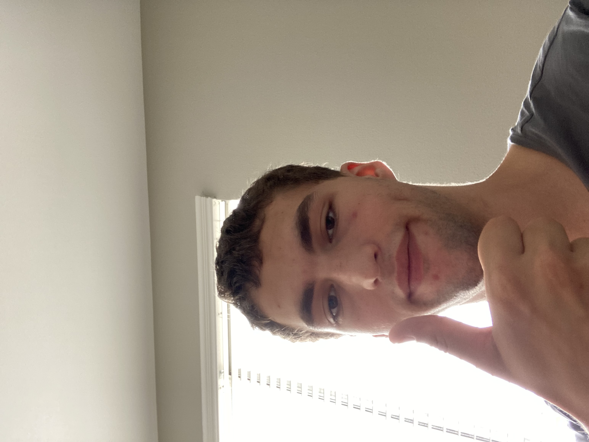

# HELLO!
My name is Andrei Secor and I *really* like to program (well, honestly it depends). It's something I've been doing for a while (let's say 8 years intermittently), and it's something I've come to like because, at the end of the day, it's about problem solving. It's kind of interesting actually, I worry very little about what languages I should learn, since it's generally easy to learn programming languages; for me, most of programming is about the problem solving, and the language is what manifests the solution. But while we're here, I think it would be fun to rant about what is, in my opinion, the weirdest programming language: C++. It's like it tries to be everything at once, and ends up being really confusing as a result. For example, when I was using hashmaps, I tried using the access methods, and it was a while before I realized you could do something like `hashMap[key]` to access the associated value, because of operator overloading. Another example: they included structs and classes in C++, there's no reason to do that, since structs are basically classes without methods. It's just really confusing, and it's not easy to tell what you can do. On another note, there are several things I like to do in my free time, including:
- Martial Arts
- Piano
- Weightlifting
- Chess (I haven't done it for a while though)
- Video games
So uh, yeah. Oh, random slightly-off-topic thing about me, I *really* enjoy getting criticized. In fact, my mentality in that regard revolves around something my martial arts instructor once said:
> If someone tells you something you did wrong, then that means that they believe you can improve it. So really, it's a compliment because they believe you can get better. If someone does not tell you you did anything wrong, then that means that they don't think you can improve, not that you did everything perfectly.
Or something along those lines, I'm not sure, it was 8-ish years ago, but the point still stands: I like getting criticized because it gives me a direction to improve in. Anything else? Oh right, I have a [github](https://github.com/andreijsecor) that I don't really use, but I guess I'll be using it more this class. There's also some other stuff in this project, like the [readme file](README.md), or the [private file](PRIVATE.txt) containing my student info (wait, why am I sharing this? it's private!). So uh, anything else left to do? Let's see:
- [x] obnoxious attention-grabbing header
- [x] why I like programming
- [x] ranting just as an excuse to get a code quote
- [x] annoyingly abrupt transitions between topics
- [x] other stuff about me
- [x] another abrupt transition just to get a quote
- [x] embedded liks just to have them
- [x] task list... ? I guess this is it
- [ ] picture
Right, I still need a picture. Uhh, let's go with this:

Wait, why is it backwards? ... Nevermind. So uh, right. I hope you found my stuff interesting, and I hope I didn't come off the wrong way with the way I worded this bio (sorry if I did, it seemed funny to me), and, yeah. Bye!

[Back To Top](index.md#hello)